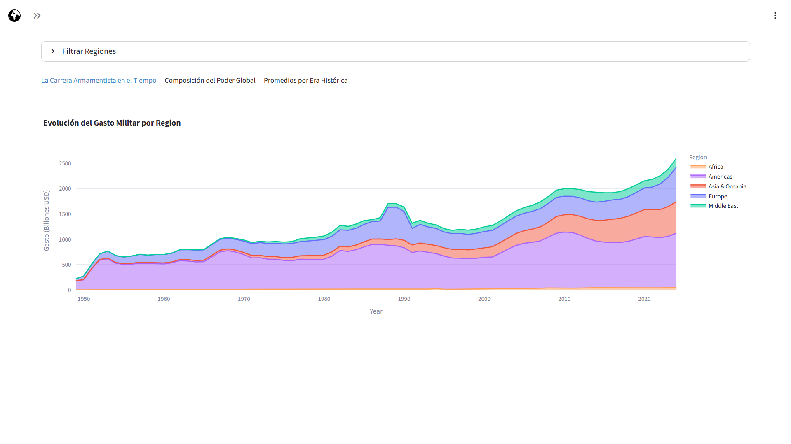
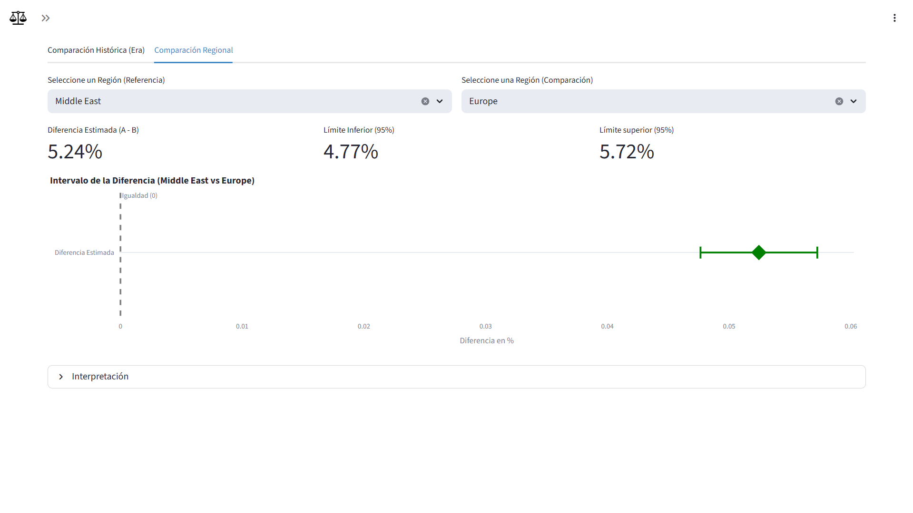

# 🛡️ Global Defense Monitor


## 📊 Descripción

El **Global Defense Monitor** es una aplicación de *Data Science* diseñada para el análisis estadístico del gasto militar global. Utilizando la base de datos del **SIPRI** (Stockholm International Peace Research Institute) y datos macroeconómicos del **Banco Mundial**, este dashboard permite explorar las dinámicas de rearme, hegemonía y conflictos geopolíticos durante el periodo **1949 - 2024**.

El proyecto no solo visualiza datos, sino que integra herramientas de inferencia estadística, cálculo de probabilidades y modelos de regresión para validar hipótesis sobre la seguridad global.

## 📸 Capturas de Pantalla

| Panorama Global | Análisis de Intervalos |
|:---:|:---:|
|  |  |

## 🎯 Características Principales

- **🌎 Panorama Global:** Visualización geoespacial de tendencias de gasto y hegemonías regionales.
- **⏳ Laboratorio Temporal:** Análisis de series de tiempo para detectar patrones históricos (Guerra Fría, Paz Armada, Actualidad).
- **📊 Análisis Univariado y Bivariado:** Estudio profundo de variables numéricas y categóricas.
- **🎲 Calculadora de Probabilidades:** Modelado de eventos simples y compuestos basados en frecuencias históricas.
- **⚖️ Inferencia Estadística:** Tests de hipótesis y análisis de intervalos de confianza para comparar regiones y eras.
- **📈 Modelado Predictivo:** Análisis de regresión lineal para correlacionar Gasto Militar con variables económicas (PBI).

---

## 📋 Requisitos Técnicos

El proyecto requiere **Python 3.8+** y las siguientes librerías principales:

* `streamlit`: Framework de la aplicación web.
* `pandas` & `numpy`: Manipulación de estructuras de datos.
* `plotly`: Visualizaciones interactivas.
* `scipy` & `statsmodels`: Cálculos estadísticos avanzados y regresiones.

---

## ⚙️ Instalación y Ejecución

Sigue estos pasos para correr la aplicación en tu entorno local:

1. **Clonar el repositorio:**
   ```bash
   git clone [https://github.com/TuUsuario/Military-Expenditure.git](https://github.com/TuUsuario/Military-Expenditure.git)
   cd Military-Expenditure
    ```

2. **Crear y activar el entorno virtual:**
    ```bash
    # En Windows
    python -m venv .venv
    .\.venv\Scripts\Activate.ps1

    # En macOS/Linux
    python3 -m venv .venv
    source .venv/bin/activate
    ```

3. **Instalar dependencias**:
    ```bash
    pip install -r requirements.txt
    ```

4. **Ejecutar la aplicación:**
    ```bash
    streamlit run Home.py
    ```
    La app se abrirá automáticamente en `http://localhost:8501`

## 📁 Estructura del Proyecto
```Plaintext
Military-Expenditure/
├── Home.py                       # 🏠 Página de inicio y navegación
├── pages/                        # 📑 Módulos de análisis
│   ├── 1_Análisis_de_Variables_Cualitativas.py
│   ├── 2_Análisis_de_Variables_Cuantitativas.py
│   ├── 3_Panorama_Global.py
│   ├── 4_Laboratorio_Temporal.py
│   ├── 5_Calculadora_de_Probabilidades.py
│   └── 6_Inferencia_Estadística.py
├── src/                          # 🧠 Lógica de negocio
│   ├── clase_analizador.py       # Clases POO para procesamiento
│   ├── datos.py                  # Carga y limpieza de datos
│   └── iso_countries.py          # Diccionarios de mapeo ISO
├── data/                         # 💾 Datasets (SIPRI + World Bank)
└── requirements.txt              # Dependencias
```

## 📝 Metodología y Datos
- Fuentes: Los datos provienen del Stockholm International Peace Research Institute (SIPRI) cruzados con indicadores económicos del Banco Mundial.

- Variables Clave: Spending_B (Gasto en billones constantes), Share_of_GDP (% del PBI), Per_Capita.

- Ingeniería de Características: Se crearon variables sintéticas como Growth_Rate y Historical_Era para segmentar el análisis en periodos geopolíticos (Guerra Fría, Post-Guerra Fría, Terrorismo, Gran Potencia).

- Notebook de Limpieza: Puedes consultar el proceso de limpieza y análisis exploratorio (EDA).

## 👤 Autor
**Brian Alaníz** | Estudiante de Ciencias de la Computación

## 📄 Licencia
Este proyecto está bajo la Licencia MIT. Consulta el archivo `LICENSE` para más detalles.